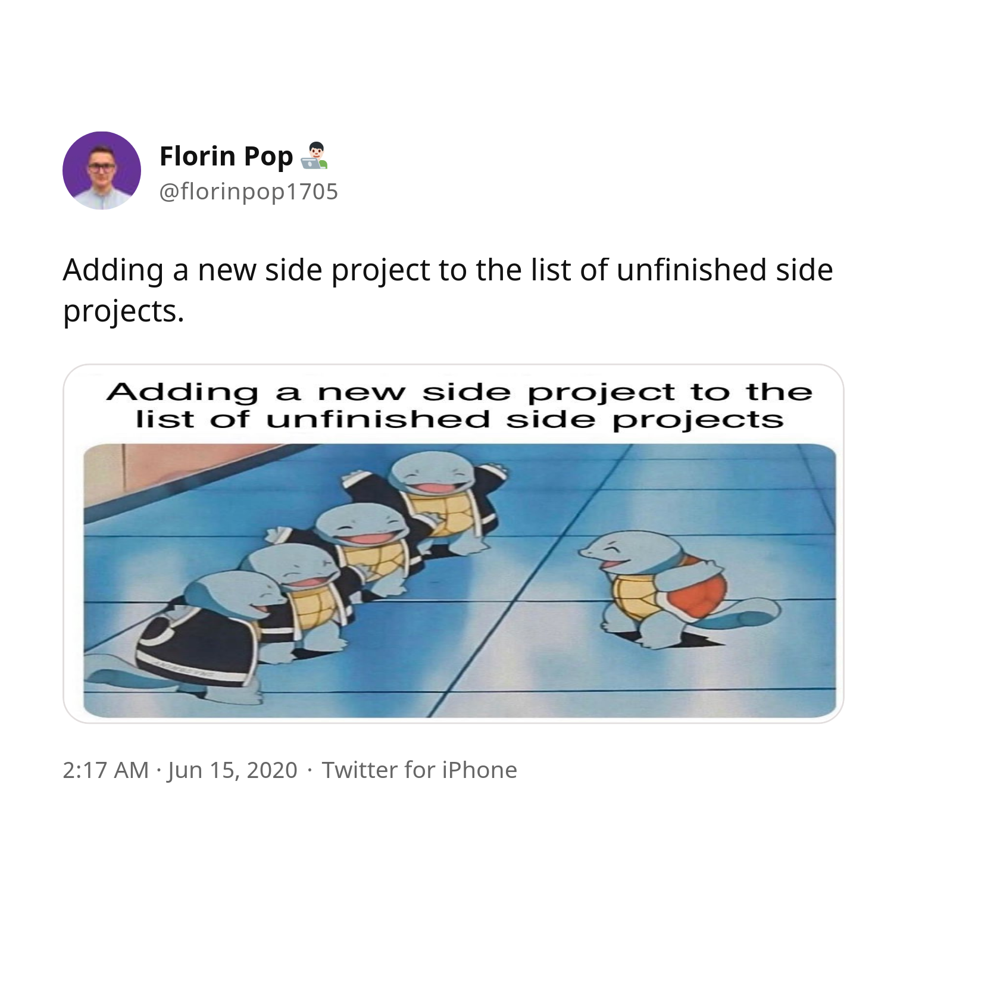
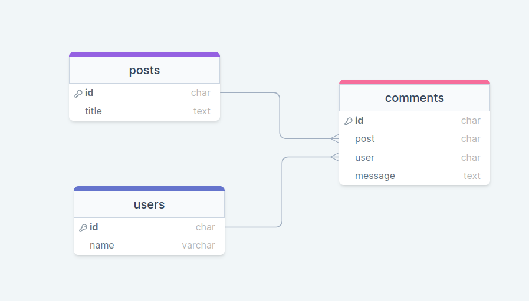
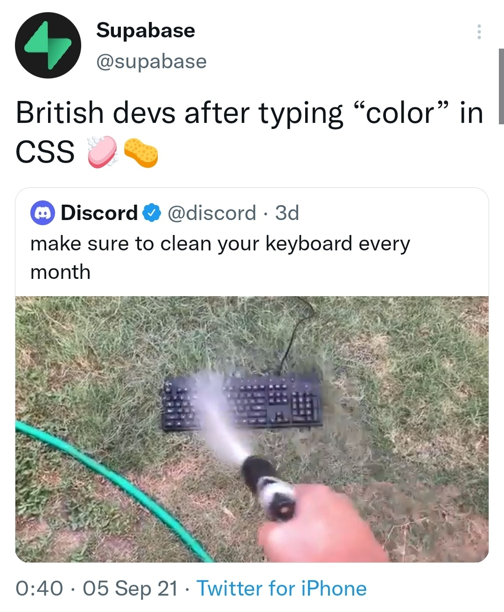

# An Introduction to PocketBase:

[A Go-Based Backend as a Service]()

<small>by Haseeb Majid</small>

notes:

- Code & Slides shared at the end

---

# About Me

- Haseeb Majid
  - A software engineer
  - https://haseebmajid.dev
- Loves cats 🐱
- Avid cricketer 🏏 #BazBall

---



---

# What is PocketBase?

> Open Source backend, for your next SaaS and Mobile app in 1 file

---

# Similar Products

- Firebase
- Supabase
- Amplify

---


---

# What is a Backend as a Service (BaaS)?

Handle the basic repetitive tasks

notes:

- Authentication
- Database Management
- Email Verification

---

# Why use PocketBase?

- Runs from a single binary
- Written in Go
  - Extend as framework
- Easy to use Dashboard

notes:

- embeds SQLite DB
- UI Written in Svelte
- Scale can handle 10k connections on $6 VPS
- Super easy to self-host

---

## Demo

[PocketBase](http://localhost:8090/_/)

notes:

`- Collections

- Fields
- API Rules
- Admin Account
- Logs`

---

## Use as a Framework

```go [5-9|11-17]
// main.go

package main

import (
    "log"

    "github.com/pocketbase/pocketbase"
)

func main() {
    app := pocketbase.New()

    if err := app.Start(); err != nil {
        log.Fatal(err)
    }
}
```

---

```bash
go run main.go serve --http=localhost:8080
```

---

## Add a Route

```go [14-18]
# main.go

import (
    "net/http"

    "github.com/labstack/echo/v5"
    "github.com/pocketbase/pocketbase"
    "github.com/pocketbase/pocketbase/apis"
    "github.com/pocketbase/pocketbase/core"
)

func main() {
    //...

    app.OnBeforeServe().Add(func(e *core.ServeEvent) error {
        e.Router.POST("/hello", handler, middlewares)
        return nil
    })
}

```

notes:

- echo V5 server

---

```go
app.OnBeforeServe().Add(func(e *core.ServeEvent) error {
    e.Router.POST("/hello", func(c echo.Context) error {
        return c.NoContent(http.StatusCreated)
    },
        apis.ActivityLogger(app),
        apis.RequireRecordAuth(),
    )
    return nil
})
```

notes:

- actual function
- some middlewares
  - log request
  - check user is auth

---

## Client Code

```js
import PocketBase from "pocketbase";

const pb = new PocketBase("http://127.0.0.1:8090");

await pb.send("/hello", {
  // for all possible options check
  // https://developer.mozilla.org/en-US/docs/Web/API/fetch#options
});
```

notes:

- fetch

---

## Add Record to DB

```go [4-9|20-24|26-29]
// ...
var _ models.Model = (*Comment)(nil)

type Comment struct {
	models.BaseModel
	Post    string `db:"post" json:"post"`
	User    string `db:"user" json:"user"`
	Message string `db:"message" json:"message"`
}

func (c *Comment) TableName() string {
	return "comments"
}

func main() {
    // ...

	app.OnBeforeServe().Add(func(e *core.ServeEvent) error {
		e.Router.POST("/hello", func(c echo.Context) error {
			comment := &Comment{
				Post:    "<post_id>",
				User:    "<user_id>",
				Message: "Hi 👋, London Gophers!",
			}

			err := app.Dao().Save(comment)
			if err != nil {
				return err
			}

			return c.NoContent(http.StatusCreated)
		},
			apis.ActivityLogger(app),
			apis.RequireRecordAuth(),
		)
		return nil
	})
}
```

---

## Expand Relations



---

## Client

```js
pb.collection("comments").getList(1, 30, {
    expand: "users"
}),
```

---

```json [11|12-17]
{
  // ...
  "items": [
    {
      // ...
      "id": "lmPJt4Z9CkLW36z",
      "collectionName": "comments",
      "post": "WyAw4bDrvws6gGl",
      "user": "FtHAW9feB5rze7D",
      "message": "Example message...",
      "expand": {
        "user": {
          "id": "FtHAW9feB5rze7D",
          "collectionId": "srmAo0hLxEqYF7F",
          "collectionName": "users"
          // ...
        }
      }
    }
  ]
}
```

---

## Migrations

```bash
lla migrations/
Permissions  Size User   Group  Date Modified Git Name
.rw-r--r--  1.4Ki haseeb haseeb  2 Apr 22:52   -- 1680445294_created_posts.go
.rw-r--r--  1.3Ki haseeb haseeb  2 Apr 22:52   -- 1680445383_created_comments.go
.rw-r--r--  2.0Ki haseeb haseeb  2 Apr 22:52   -- 1680445466_updated_comments.go
.rw-r--r--  1.0Ki haseeb haseeb  2 Apr 22:52   -- 1680445481_updated_posts.go
```

---

```go [11|16-19]
// main.go
package main

import (
    "log"

    "github.com/pocketbase/pocketbase"
    "github.com/pocketbase/pocketbase/plugins/migratecmd"

    // you must have have at least one .go migration file in the "migrations" directory
    _ "gitlab.com/hmajid2301/talks/an-intro-to-pocketbase/example/migrations"
)

func main() {
    app := pocketbase.New()

    migratecmd.MustRegister(app, app.RootCmd, &migratecmd.Options{
        Automigrate: true, // auto creates migration files when making collection changes
    })

    // ...
}
```

---

## SQLite

- Does it Scale?
  - Write-Ahead Logging (WAL mode)

notes:

---

## What is WAL Mode?

<iframe src="images/wal_animation.html" width="1000" height="500"  frameborder="0">

notes:

- SQLite groups rows together into 4KB chunks called "pages".
- benefits
- POSIX system call `fsync()` commits buffered data to permanent storage or disk
- `fsync()` is expensive

---

## Why use WAL Mode?

- Is significantly faster in most scenarios.
- WAL uses many fewer `fsync()` operations
- Provides more concurrency as a writer does not block readers.

notes:

- No network file support
- Not atomic when commits across separate DB's
- Might be slightly slower 1-2% for read heavy and very rare write apps
- In rollback mode, you can have concurrent readers but not readers & writers

---

## Testing

```go [29-41|43-45]
package main

import (
	"net/http"
	"testing"

	"github.com/pocketbase/pocketbase/tests"
	"github.com/pocketbase/pocketbase/tokens"
)

const testDataDir = "./test_pb_data"

func TestHelloEndpoint(t *testing.T) {
	recordToken, err := generateRecordToken("users", "test@example.com")
	if err != nil {
		t.Fatal(err)
	}

	setupTestApp := func() (*tests.TestApp, error) {
		testApp, err := tests.NewTestApp(testDataDir)
		if err != nil {
			return nil, err
		}

		bindAppHooks(testApp)
		return testApp, nil
	}

	scenarios := []tests.ApiScenario{
		{
			Name:   "try to get response",
			Method: http.MethodPost,
			Url:    "/hello",
			RequestHeaders: map[string]string{
				"Authorization": recordToken,
			},
			ExpectedStatus:  201,
			ExpectedContent: nil,
			TestAppFactory:  setupTestApp,
		},
	}

	for _, scenario := range scenarios {
		scenario.Test(t)
	}
}

func generateRecordToken(collectionNameOrId string, email string) (string, error) {
	app, err := tests.NewTestApp(testDataDir)
	if err != nil {
		return "", err
	}
	defer app.Cleanup()

	record, err := app.Dao().FindAuthRecordByEmail(collectionNameOrId, email)
	if err != nil {
		return "", err
	}

	return tokens.NewRecordAuthToken(app, record)
}
```

---

# Deploy


---

# Dockerfile

```dockerfile [11-16]
FROM golang:1.20-alpine as builder

WORKDIR /build
RUN apk update && apk upgrade && \
	apk add --no-cache ca-certificates && \
	update-ca-certificates

COPY . .
RUN CGO_ENABLED=0 GOOS=linux go build -o example main.go

FROM scratch
COPY --from=builder /build/example .
COPY --from=builder /etc/ssl/certs/ca-certificates.crt /etc/ssl/certs/

ENTRYPOINT [ "./example" ]
CMD ["serve", "--http=0.0.0.0:8080"]
```

---

# fly.io

```toml [7-8|45-47]
app = "example"
kill_signal = "SIGINT"
kill_timeout = 5
processes = []

[build]
dockerfile = "Dockerfile"

[env]
ENV = "production"

[experimental]
allowed_public_ports = []
auto_rollback = true
enable_consul = true

[[services]]
http_checks = []
internal_port = 8080
processes = ["app"]
protocol = "tcp"
script_checks = []

[services.concurrency]
hard_limit = 25
soft_limit = 20
type = "connections"

[[services.ports]]
force_https = true
handlers = ["http"]
port = 80

[[services.ports]]
handlers = ["tls", "http"]
port = 443

[[services.tcp_checks]]
grace_period = "1s"
interval = "15s"
restart_limit = 0
timeout = "2s"

[mounts]
destination = "/pb_data"
source = "pb_data"
```

---

```bash
fly deploy
```

---

## Gitlab CI

```yml
deploy
  stage: deploy
  only:
    - main
  image: docker
  services:
    - docker:dind
  before_script:
    - apk add curl
    - curl -L https://fly.io/install.sh | sh
  script:
    - /root/.fly/bin/flyctl deploy
```

---

## Caveats

- Need to self-host
- Does not have a stable API yet
- Can only scale vertically
  - [LiteFS](https://fly.io/blog/introducing-litefs/)

notes:

- Scale horizontaly with LiteFS

---



---

# Any Questions?

- Code: https://gitlab.com/hmajid2301/talks/an-intro-to-pocketbase
- Slides: https://haseebmajid.dev/talks/an-intro-to-pocketbase/

---

# Useful Links

- [PocketBase](https://pocketbase.io/docs/)
- [Fireship Video on PocketBase](https://www.youtube.com/watch?v=Wqy3PBEglXQ)
- [WAL Mode Explained](https://www.youtube.com/watch?v=86jnwSU1F6Q)
- [LiteFS](https://fly.io/blog/introducing-litefs/)
- [My App Built Using PocketBase](https://gitlab.com/bookmarkey)
