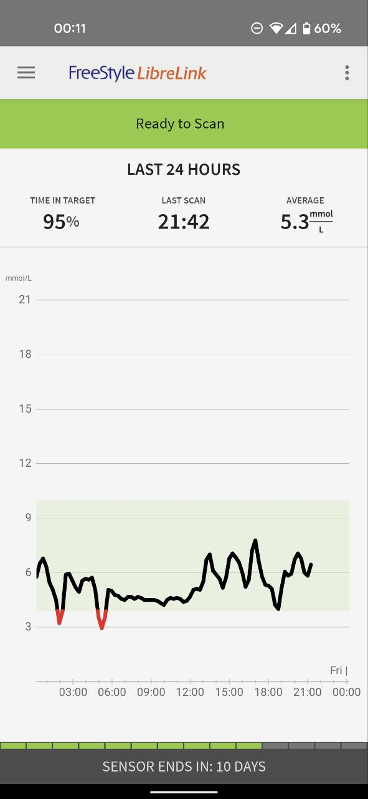
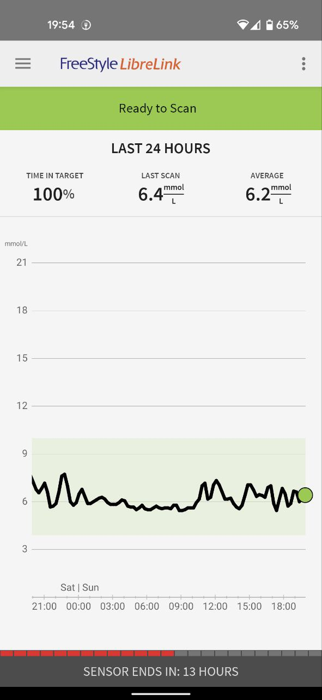
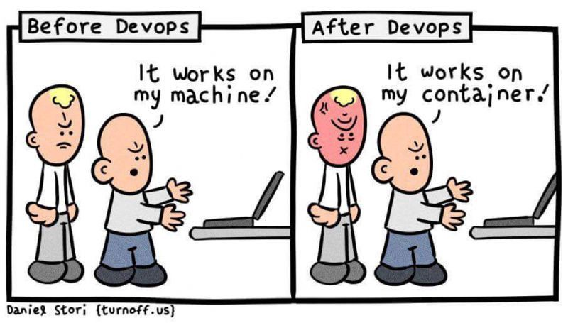
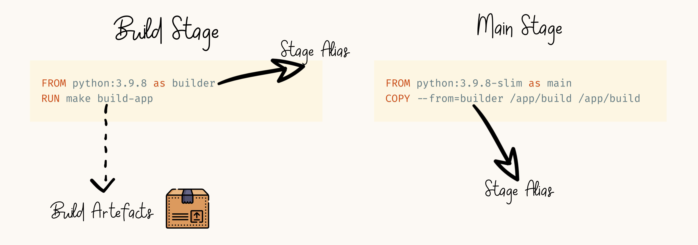

# My Journey Using Docker as a Development Tool:


From Zero to Hero

<small>by Haseeb Majid</small>

<!-- .slide: data-background="#fac828" -->

---

# About Me

- Haseeb Majid
  - A Software Engineer
  - https://haseebmajid.dev
- Avid cricketer 🏏
- Loves cats 🐱

notes:

- Code & Slides shared at the end

---

# ZOE

- I work for ZOE 🥑
  - https://joinzoe.com 
  - Personalised nutrition startup
  - Health study

notes:

- Understand how your body responds to food
- Allow people to contribute to research into major diseases cancer, dementia, and heart disease
  - from covid

----

# CGM Trace

<section>
  
  
</section>

notes:

- Breathe

----

# Who Is This Talk For?

- Have used Docker
  - But not an expert
- Know basic CLI commands
- Want to use Docker in CI

notes:

- Learn more about using 
- in CI
- Multistage builds

---

# Example Code

- Simple FastAPI web-service 
  - Interacts with DB
- It allows us to get and add new users
- Poetry for dependency management

notes:

- FastAPI is a "async" Python Web framework, similar to Flask
- Postgres database

----

# Why Docker?

- Reproducible builds
  - Easy setup developers
  - OS independent

notes:

- Start with this Upgrading MacOS nothing builds locally virtualenv
- Docker daemon running
- Easier to upgrade to new python versions

----



---

# My First Image

```Dockerfile [3|5-20|22-23|25-27|28-29|31]
# Dockerfile

FROM python:3.9.8

ENV PYTHONUNBUFFERED=1 \
	PYTHONDONTWRITEBYTECODE=1 \
	PYTHONPATH="/app" \
	PIP_NO_CACHE_DIR=off \
	PIP_DISABLE_PIP_VERSION_CHECK=on \
	PIP_DEFAULT_TIMEOUT=100 \
	\
	POETRY_VERSION=1.1.11 \
	POETRY_HOME="/opt/poetry" \
	POETRY_VIRTUALENVS_IN_PROJECT=true \
	PYSETUP_PATH="/opt/pysetup" \
	POETRY_NO_INTERACTION=1 \
	\
	VENV_PATH="/opt/pysetup/.venv"

ENV PATH="$POETRY_HOME/bin:$VENV_PATH/bin:$PATH"

WORKDIR $PYSETUP_PATH
COPY pyproject.toml poetry.lock ./

RUN pip install poetry==$POETRY_VERSION && \
	poetry install

WORKDIR /app
COPY . .

CMD [ "bash", "/app/start.sh" ]
```

notes:

PYTHONDONTWRITEBYTECODE: prevents writing out pyc files
PYTHONUNBUFFERED: sent straight to terminal real time

Create a new file called Dockerfile

----

# Let's Run It

```bash
docker build --tag app .
docker run --publish 80:80 app

# Access app on http://localhost
```

notes:

- Maps port 80 on the host to port 80 in the docker container
- So we can access the app outside of the docker container

----


---

# App Dependencies

- App depends on a database
  - Dockerise it


notes:

- Easy to extend docker compose file

----

# Without Docker

```bash
sudo apt update
sudo apt install postgresql postgresql-contrib
sudo systemctl start postgresql.service

sudo -u postgres createuser --interactive
sudo -u postgres createdb test
```

notes:

How we might have to install it like so

----

# With Docker

```bash
  docker run --volume "postgres_data:/var/lib/postgresql/data" \
  --environment "POSTGRES_DATABASE=postgres" \
  --environment "POSTGRES_PASSWORD=postgres" \
  --publish "5432:5432" \
    postgres:13.4
```

----

<pre class="stretch">
  <code data-trim data-noescape class="bash" data-line-numbers="1-17|18-24">
  # Start Commands: 
  docker network create --driver bridge workspace_network
  docker volume create  postgres_data
  docker build -t app .
  docker run --environment "POSTGRES_USER=postgres" \
    --environment "POSTGRES_HOST=postgres" \
    --environment "POSTGRES_DATABASE=postgres" \
    --environment "POSTGRES_PASSWORD=postgres" \
    --environment "POSTGRES_PORT=5432" \
    --volume "./:/app" --publish "80:8080" \
    --network workspace_network --name workspace_app \
    --detach app
  docker run --volume "postgres_data:/var/lib/postgresql/data" \
  --environment "POSTGRES_DATABASE=postgres" \
  --environment "POSTGRES_PASSWORD=postgres" \
  --publish "5432:5432" --network workspace_network \ 
  --name workspace_postgres --detach postgres:13.4

  # Delete Commands: 
  docker stop workspace_app
  docker rm workspace_app
  docker stop workspace_postgres
  docker rm workspace_postgres
  docker network rm workspace_network
  </code>
</pre>

----


notes:

- Thinking is there a better way as a dev

---

# Docker Compose

- Manage multiple Docker containers
- Existing tool docker-compose
  - V2 called docker compose
- Use docker compose today


notes:

- Easy way to manage multiple containers
- Aimed at single host development
- There is a similar tool called docker-compose
  - The new version is called docker compose
  - Will be deprecated soon
- New version written in Golang as a Docker plugin

----

```yaml [4|5-7|8|9-14|15-16|17-18|20|20-28]
# docker-compose.yml

services:
  app:
    build:
      context: .
      dockerfile: Dockerfile
    command: bash /app/start.sh --reload
    environment:
      - POSTGRES_USER=postgres
      - POSTGRES_HOST=postgres
      - POSTGRES_DATABASE=postgres
      - POSTGRES_PASSWORD=postgres
      - POSTGRES_PORT=5432
    volumes:
      - ./:/app
    ports:
      - 127.0.0.1:80:80

  postgres:
    image: postgres:13.4
    volumes:
      - postgres_data:/var/lib/postgresql/data
    environment:
      - POSTGRES_DATABASE=postgres
      - POSTGRES_PASSWORD=postgres
    ports:
      - 127.0.0.1:5432:5432
```

notes:

- env variables 12 factor app
- postgres host matches service name

----

# Run It!!!

```
docker compose up --build
```

----

# Summary

- Dockerise your app
- Dockerise dependencies (DB)
- Use docker compose
  - Manage multiple containers

----


notes:

- lets pretend we want to run tests

---

# Running Tests

- Run tests in Docker
  - pytest runner
- Consistent environment

notes:

- Same local and CI
- Different environments
- Different dependencies locally and CI or production
- Imagine postgres version

----

```bash
docker compose run app pytest
```

```yaml [8-9|12]
# docker-compose.yml

services:
 app:
    build:
      context: .
      dockerfile: Dockerfile
    depends_on:
      - postgres
    # ...

  postgres:
	# ...
```

---

# CI Pipeline

- Docker running locally
- Can we use Docker in CI? 

notes:

- Next thing I looked at doing was now using Docker in CI
- Can we use Docker in CI as well
- Easier to move CI

----


----

# Before

```yaml [3|14-22|24-28|29-32|33-40]
# .github/workflows/branch.yml

name: Check changes on branch

on:
  push:
    branches:
      - "*"
      - "!main"

jobs:
  test:
    runs-on: ubuntu-latest
    services:
      postgres:
        image: postgres:13.4
        env:
          POSTGRES_USER: postgres
          POSTGRES_PASSWORD: postgres
          POSTGRES_DB: postgres
        ports:
          - 5432:5432
    steps:
      - uses: actions/checkout@v3
      - name: Set up Python 3.9
        uses: actions/setup-python@v3
        with:
          python-version: 3.9
      - name: Install dependencies
        run: |
          pip install poetry=1.11.0
          poetry install
      - name: Test with pytest
        run: |
        export DB_USERNAME=postgres
        export DB_PASSWORD=postgres
        export DB_HOST=postgres
        export DB_PORT=5432
        export DB_NAME=postgres
        pytest
```

----

# After


```yaml [14]
# .github/workflows/branch.yml

name: Check changes on branch

#...

jobs:
  test:
    runs-on: ubuntu-latest
    timeout-minutes: 5
    steps:
      - uses: actions/checkout@v3
      - name: Run Tests
        run: docker compose run app pytest
```

----

# Summary

- Dockerise development tasks
  - Tests
  - Linting
  - DB migrations
- Use Docker on CI
  - Local environment = CI enviromnent

----


notes:

- Bob is like CI is a bit slow, is there way we can speed it up

---

# Smaller Image

- Image is large 
- Redundant dependencies
- Fewer security vectors
- Less storage

notes:

So this is what I did next!

- Slower upload times
  - Save 30 seconds CI
- Lots of extra dependencies we don't need
  - Reduces attack surface
  - Less things that can break

----

```Dockerfile [3]
# Dockerfile

FROM python:3.9.8-slim

# ...

WORKDIR $PYSETUP_PATH
COPY pyproject.toml poetry.lock ./

RUN pip install poetry==$POETRY_VERSION && \
	poetry install

WORKDIR /app
COPY . .

CMD [ "bash", "/app/start.sh" ]
```

notes:

Alpine Comptability

----

# Comparison

|                 | python:3.9.8 | python:3.9.8-slim |
|-----------------|--------------|-------------------|
| Size            | 1 GB         | 280 MB            |
| Build[1]        | 75 sec       | 30 sec            |
| CI Pipeline Job | 2 min 40 sec | 1 min 57 sec      |


<div style="text-align: left;margin-top: 1em;">
  <small>[1] No Cache</small>
</div>

notes:

- Say exact values

----

# Summary

- Aim to use smaller base images
- Reduce unnecessary dependencies
- Save time during build time

----


---

# Dependencies

- Dev dependencies in Docker image
  - Don't need pytest in prod

notes:

Then I did this:

- We are installing our dev dependencies inside of our Docker image such as pytest
- We don't need pytest in our production image

----

# Multistage Builds


Notes:

- Put your hand up if you've heard of multistage builds

----



Notes:

- Multiple FROM statements
- Copy build artefacts from a previous stage
- Build deps vs run deps

----

# Image

```dockerfile [3|22-29|32-40|43-51|45]
# Dockerfile

FROM python:3.9.8-slim as base

ARG PYSETUP_PATH
ENV PYTHONPATH="/app"
ENV PIP_NO_CACHE_DIR=off \
	PIP_DISABLE_PIP_VERSION_CHECK=on \
	PIP_DEFAULT_TIMEOUT=100 \
	\
	POETRY_VERSION=1.1.11 \
	POETRY_HOME="/opt/poetry" \
	POETRY_VIRTUALENVS_IN_PROJECT=true \
	PYSETUP_PATH="/opt/pysetup" \
	POETRY_NO_INTERACTION=1 \
	\
	VENV_PATH="/opt/pysetup/.venv"

ENV PATH="$POETRY_HOME/bin:$VENV_PATH/bin:$PATH"


FROM base as builder

RUN pip install poetry==$POETRY_VERSION

WORKDIR $PYSETUP_PATH
COPY poetry.lock pyproject.toml ./

RUN poetry install --no-dev


FROM builder as development

RUN poetry install

WORKDIR /app
COPY . .

EXPOSE 80
CMD ["bash", "/app/start.sh", "--reload"]


FROM base as production

COPY --from=builder $VENV_PATH $VENV_PATH

WORKDIR /app
COPY . .

EXPOSE 80
CMD ["bash", "/app/start.sh"]
```


----

```yaml [6-8]
# docker-compose.yml

services:
  app:
    build:
      context: .
      dockerfile: Dockerfile
      target: development
    command: bash /app/start.sh --reload
    depends_on:
      - postgres
    environment:
      - # ...
    volumes:
      - ./:/app
    ports:
      - 127.0.0.1:80:80

```

----

# Comparison

|          | python:3.9.8-slim | Multistage[2] |
|----------|-------------------|----------------|
| Size     | 280 MB            | 200 MB         |
| Build[1] | 30 Seconds        | 35 seconds     |


<div style="text-align: left;margin-top: 2em;">
  <small>[1] No Cache</small>
  <br>
  <small>[2] Building for production target</small>
</div>

----

# !Root

```dockerfile [5-7|9]
# Dockerfile

FROM base as production

RUN addgroup --gid 1000 --system app \
    && adduser --no-create-home --shell \
    /bin/false --disabled-password --uid 1000 --system --group app

USER app
COPY --from=builder $VENV_PATH $VENV_PATH

# ...
```

notes:

- Don't want to run as root
- Reduces chance of exploit
- Most applications don't need root permissions
- After this all commands are run as app user

----

# Cache From

```yaml [8-9]
# docker-compose.yml

services:
  app:
    build:
      context: .
      target: development
      cache_from:
        - registry.gitlab.com/haseeb-slides/developing-with-docker-slides/python-image:latest
    command: bash /app/start.sh --reload
    # ....
```

notes: 

- If the provided image and your current build have layers in common, you get the same speed up as if the image had been built on the same machine.
- Without using --cache-from our build script would always have to execute every command in the Dockerfile, as the build cache would be empty:
- saves about 5 seconds on CI

---

# Private Deps 

- Private git repository
- Inject an SSH key
  - At build time

notes:

- New requirements, event based create new user
- Can we inject an ssh key only during build time
- Running PyPI is heavy

----


notes:

- Less chance of accidently committing

----

```bash
poetry add git+ssh@github.com:zoe/pubsub.git
```

```toml [4-5]
  [tool.poetry.dependencies]
  python = "^3.9"
  fastapi = "^0.70.0"
  pubsub = { git = "ssh://git@github.com:zoe/pubsub.git",
              rev = "0.2.5" }
  psycopg2-binary = "^2.9.3"
  SQLAlchemy = "^1.4.36"
  uvicorn = "^0.17.6"
```


notes:

- Library to listen to events to create users

----

```dockerfile [3-7|12]
FROM base as builder

RUN apt-get update && \
    apt-get install openssh-client git -y && \
    mkdir -p -m 0600 \
    ~/.ssh && ssh-keyscan github.com >> ~/.ssh/known_hosts && \
    pip install poetry==$POETRY_VERSION

WORKDIR $PYSETUP_PATH
COPY poetry.lock pyproject.toml ./

RUN --mount=type=ssh poetry install --no-dev
```

----

First add our ssh key

```bash
ssh-add ~/.ssh/id_rsa
```

Then we can do

```
docker compose build --ssh default
```

----

# CI Changes

```yml [1|9-11|12-13]
# .github/workflows/branch.yml

jobs:
  # ...
  test:
    # ...
    steps:
      - uses: actions/checkout@v3
      - uses: webfactory/ssh-agent@v0.5.4
        with:
          ssh-private-key: ${{ secrets.PRIVATE_SSH_KEY }}
      - name: Build Image
        run: docker compose build --ssh default
      - name: Run Tests
        run: docker compose run app pytest
```

----

# Comparison

|          | python:3.9.8-slim[2]  | Multistage[3]   |
|----------|------------|------------|
| Size     | 400 MB     | 200 MB     |
| Build[1] | 39 Seconds | 46 seconds |


<div style="text-align: left;margin-top: 1em;">
  <small>[1] No Cache</small>
  <br>
  <small>[2] Assuming there was no multistage build</small>
  <br />
  <small>[3] Building for production target</small>
</div>

notes:

- Assuming we have no multistage build


----

# Summary

- Use multistage builds 
  - Slimmer production images
- Use non-root users
- Leverage SSH injection during build time

---

# What Did We Do?

- Dockerised app/deps
- Used docker compose
- Used Docker for dev tasks
- Multistage builds

---

# Even Better

- Common base image
- Makefile
- Devcontainer in VSCode
- Docker Python interpreter in Pycharm

---

# Any Questions ?

- Code: https://gitlab.com/haseeb-slides/docker-as-a-dev-tool
- Slides: https://docker-as-a-dev-tool.haseebmajid.dev/

----

# Appendix 

- [Breaking Down Docker by Nawaz Siddiqui](https://kubesimplify.com/breaking-down-docker#heading-virtual-machines)
- [Announcing Compose V2 General Availability](https://www.docker.com/blog/announcing-compose-v2-general-availability/)
- [Caching Docker layers on serverless build hosts with multi-stage builds](https://andrewlock.net/caching-docker-layers-on-serverless-build-hosts-with-multi-stage-builds---target,-and---cache-from/)
- [Using Alpine can make Python Docker builds 50× slower](https://pythonspeed.com/articles/alpine-docker-python/)
- [Docker Slim](https://github.com/docker-slim/docker-slim)
- [Dive](https://github.com/wagoodman/dive)
- [Anchore image scan](https://github.com/anchore/anchore-engine)
