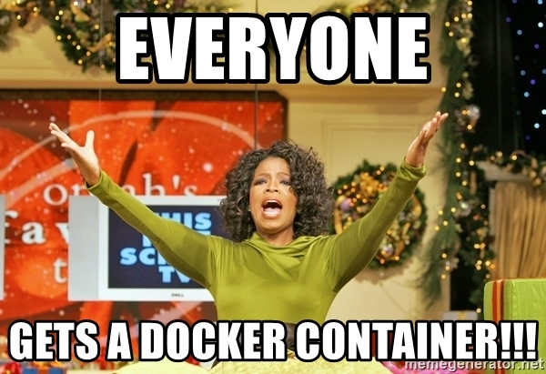

# My Journey Using Docker as a Development Tool

<!-- .slide: data-background="#fac828" -->

By Haseeb Majid

---

# About Me

- Haseeb Majid
  - A Software Engineer
  - https://haseebmajid.dev
- Avid 🏏 cricketer
- I work for 🥑 ZOE 
  - https://joinzoe.com 
  - Personalised nutrition startup
  - Health Study
- 🐱 Loves cats

---

# Who is this talk for?

- Have used Docker
  - But not an expert
- Know basic CLI commands
- Want to use Docker in CI

notes:

- Learn more about using 
- in CI
- Multistage builds

---

# Example Code

- Simple FastAPI Web Service 
  - Interacts with DB
- It allows us to get and add new users

notes:

- FastAPI is a "async" Python Web framework, similar to Flask
- Postgres database

----

# Why Docker?

- Reproducible builds
  - Easy setup developers
  - OS Independent

notes:

- Upgrading MacOS nothing builds locally virtualenv
- Docker daemon running

----


----

# My First Image

```dockerfile [3|5|7|9]
# Dockerfile

FROM tiangolo/uvicorn-gunicorn-fastapi:python3.9

COPY ./requirements.txt /app/requirements.txt

RUN pip install --no-cache-dir --upgrade -r /app/requirements.txt

COPY ./app /app
```

notes:

Create a new file called `Dockerfile`

Used to be the example on FastAPI but since been removed

----

# Let's run it

```bash
docker build -t app .
docker run -p 80:80 app

# Access app on http://localhost
```

notes:

Maps port 80 on the host to port 80 in the docker container

----


---

# docker compose

- Manage multiple Docker containers
- Existing tool `docker-compose`
  - V2 called `docker compose`
- Use `docker compose` today


notes:

- Easy way to manage multiple containers
- Aimed at single host development
- There is a similar tool called docker-compose
  - The new version is called docker compose
  - Will be deprecated soon
- New version written in Golang as a Docker plugin

----

```yaml [3-5|6-7]
services:
  app:
    build: 
      context: .
      dockerfile: Dockerfile
    volumes:
      - ./app:/app
    ports:
      - 80:80
```

```
docker compose up --build
```

----


---

# App Dependencies

- App depends on a Database
  - Dockerise it


notes:

- Easy to extend docker compose file

----

# Without Docker

```bash
sudo apt update
sudo apt install postgresql postgresql-contrib
sudo systemctl start postgresql.service

sudo -u postgres createuser --interactive
sudo -u postgres createdb test
```

notes:

How we might have to install it like so

----

# With Docker

```bash
  docker run --volume "postgres_data:/var/lib/postgresql/data" \
  --environment "POSTGRES_DATABASE=postgres" \
  --environment "POSTGRES_PASSWORD=postgres" \
  --publish "5432:5432" \
  --detach postgres:13.4
```

----

# With docker compose

```yaml [5-10|16-24]
# docker-compose.yml

services:
  app:
    environment:
      - POSTGRES_USER=postgres
      - POSTGRES_HOST=postgres
      - POSTGRES_DATABASE=postgres
      - POSTGRES_PASSWORD=postgres
      - POSTGRES_PORT=5432
    volumes:
      - ./:/app
    ports:
      - 80:80

  postgres:
    image: postgres:13.4
    volumes:
      - postgres_data:/var/lib/postgresql/data
    environment:
      - POSTGRES_DATABASE=postgres
      - POSTGRES_PASSWORD=postgres
    ports:
      - 5432:5432
```

----

```
docker compose up --build
```

----

<pre class="stretch">
  <code data-trim data-noescape class="bash">
  # Start Commands: 
  docker network create --driver bridge workspace_network
  docker volume create  postgres_data
  docker run --environment "POSTGRES_USER=postgres" \
    --environment "POSTGRES_HOST=postgres" \
    --environment "POSTGRES_DATABASE=postgres" \
    --environment "POSTGRES_PASSWORD=postgres" \
    --environment "POSTGRES_PORT=5432" \
    --volume "./:/app" --publish "80:8080" \
    --network workspace_network --name workspace_app \
    --detach Dockerfile
  docker run --volume "postgres_data:/var/lib/postgresql/data" \
  --environment "POSTGRES_DATABASE=postgres" \
  --environment "POSTGRES_PASSWORD=postgres" \
  --publish "5432:5432" --network workspace_network \ 
  --name workspace_postgres --detach postgres:13.4

  # Delete Commands: 
  docker stop workspace_app
  docker rm workspace_app
  docker stop workspace_postgres
  docker rm workspace_postgres
  docker network rm workspace_network
  </code>
</pre>

notes:

Equivalent docker compose vs docker comamnds

----



----

# Port Binding

```yaml [7]
# docker-compose.yml

services:
  app:
    # ...
    ports:
      - 80:80
```

----


```yaml [21|31]
services:
  app:
    # ...
    ports:
      - 127.0.0.1:80:80
```

notes:

- Bind to host `0.0.0.0`
- It forwards it to be accessible on every network interface on your system 

---

# Running Tests

- Run tests in Docker
  - `pytest` runner
- Consistent Environment

notes:

- Same local and CI
- Different environments
- Different dependencies locally and CI or production
- Imagine postgres version
- Seek files

----

```bash
docker compose run app pytest
```

```yaml [6-8|10]
services:
 app:
    build:
      context: .
      dockerfile: Dockerfile
    depends_on:
      - postgres
    # ...

  postgres:
	# ...
```

---

# CI Pipeline

- Docker running locally
- Can we use Docker in CI? 

notes:

- Next thing I looked at doing was now using Docker in CI
- Can we use Docker in CI as well
- Easier to move CI

----


----

# Before

```yaml [16|17-20|21-25|28]
# .github/workflows/branch.yml
name: Check changes on branch

on:
  push:
    branches:
      - "*"
      - "!main"

jobs:
  build:

    runs-on: ubuntu-latest

    steps:
      - uses: actions/checkout@v3
      - name: Set up Python 3.9
        uses: actions/setup-python@v3
        with:
          python-version: 3.9
      - name: Install dependencies
        run: |
          python -m pip install --upgrade pip
          pip install pytest
          if [ -f requirements.txt ]; then pip install -r requirements.txt; fi
      - name: Test with pytest
        run: |
          pytest
```

----


```yaml [5-9|12-18|18]
# .github/workflows/branch.yml

name: Check changes on branch

on:
  push:
    branches:
      - "*"
      - "!main"

jobs:
  test:
    runs-on: ubuntu-latest
    timeout-minutes: 5
    steps:
      - uses: actions/checkout@v3
      - name: Run Tests
        run: docker compose run app pytest
```

----


---

# Smaller image

- Image is large 
- Redundant Deps
- Less storage
  - 1.05GB -> 215MB

notes:

So this is what I did next!

- Slower upload times
  - Save 30 seconds CI
- Lots of extra dependencies we don't need
  - Reduces attack surface
  - Less things that can break

----

```Dockerfile [1|3|11]
FROM python:3.9.8-slim

COPY ./requirements.txt start.sh /app

RUN pip install --no-cache-dir --upgrade -r /app/requirements.txt

COPY ./app /app

WORKDIR /app

CMD [ "bash", "/app/start.sh" ]
```

---

# Alpine vs Slim

- Lack of support
  - Standard PyPI wheels
  - musl vs glibc
- Image Size

notes:

  Alpine
    - Comptability Issues
    - Standard PyPI wheels don’t work on Alpine

----


---

# Dependencies

- Dev dependencies in Docker image
  - Don't need `pytest` in prod
- Less storage
  - 215MB -> 201MB

notes:

Then I did this:

- We are installing our dev dependencies inside of our Docker image such as pytest
- We don't need pytest in our production image

----


```
black==22.3.0
fastapi==0.78.0
psycopg2-binary==2.9.3
pytest==7.1.2
sqlalchemy==1.4.36
uvicorn==0.15.0
```

----

`requirements.prod.txt`

```
fastapi==0.78.0
psycopg2-binary==2.9.3
sqlalchemy==1.4.36
uvicorn==0.15.0
```

and `requirements.txt`

```
-r requirements.prod.txt

black==22.3.0
pytest==7.1.2
```

notes:

Split into two files

----


----

# Multistage Builds


Notes:

- Put your hand up if you've heard of multistage builds

----


Notes:

- Multiple `FROM` statements
- Copy build artefacts from a previous stage

----

# Image

<pre class="stretch">
  <code data-trim data-noescape data-line-numbers="1-6|8-20|23-40|29-32" class="dockerfile">
  FROM python:3.9.8 as builder

  COPY requirements.prod.txt /app/requirements.prod.txt

  RUN pip install --no-cache-dir -r /app/requirements.prod.txt && \
    rm /app/requirements.prod.txt

  FROM builder as development

  COPY requirements.txt start.sh /app/

  RUN pip install --no-cache-dir -r /app/requirements.txt && \
    rm -r /app/requirements.txt

  WORKDIR /app
  COPY . /app

  EXPOSE 80

  CMD ["bash", "/app/start.sh", "--reload"]


  FROM python:3.9.8-slim as production

  # ...

  COPY start.sh /app/start.sh

  COPY --from=builder /usr/local/bin/uvicorn /usr/local/bin/uvicorn
  COPY --from=builder /usr/local/lib/python3.9/site-packages/ \
      /usr/local/lib/python3.9/site-packages/

  COPY ./app /app

  EXPOSE 80

  CMD ["bash", "/app/start.sh"]
  </code>
</pre>


----

```yaml [4-6]
services:
  app:
    build:
      context: .
      dockerfile: Dockerfile
      target: development
    command: bash /app/start.sh --reload
    depends_on:
      - postgres
    environment:
      - # ...
    volumes:
      - ./:/app
    ports:
      - 127.0.0.1:80:80

```

---

# Dep Management

- Two files for deps
- Use poetry

notes:
  - Two files to manage deps
  - Use a tool like poetry to manage both for us
  - Reproducible builds

----

We need a `pyproject.toml` file

```toml
# ...

[tool.poetry.dependencies]
python = "^3.9"
fastapi = "^0.78.0"
psycopg2-binary = "^2.9.3"
SQLAlchemy = "^1.4.36"
uvicorn = "^0.17.6"

[tool.poetry.dev-dependencies]
black = "^22.3.0"
pytest = "^7.1.2"

# ...
```

----


----

<pre class="stretch">
  <code data-trim data-noescape data-line-numbers="3-15|20-27|30-39|42-50" class="dockerfile">
  FROM python:3.9.8-slim as base

  ARG PYSETUP_PATH
  ENV PYTHONPATH="/app"
  ENV PIP_NO_CACHE_DIR=off \
    PIP_DISABLE_PIP_VERSION_CHECK=on \
    PIP_DEFAULT_TIMEOUT=100 \
    \
    POETRY_VERSION=1.1.11 \
    POETRY_HOME="/opt/poetry" \
    POETRY_VIRTUALENVS_IN_PROJECT=true \
    PYSETUP_PATH="/opt/pysetup" \
    POETRY_NO_INTERACTION=1 \
    \
    VENV_PATH="/opt/pysetup/.venv"

  ENV PATH="$POETRY_HOME/bin:$VENV_PATH/bin:$PATH"

  FROM base as builder

  RUN pip install poetry

  WORKDIR $PYSETUP_PATH
  COPY poetry.lock pyproject.toml ./

  RUN poetry install --no-dev


  FROM python:3.9.8-slim as production

  COPY --from=builder $VENV_PATH $VENV_PATH

  WORKDIR /app
  COPY ./app ./

  EXPOSE 80
  CMD ["bash", "/app/start.sh"]


  FROM builder as development

  RUN poetry install

  WORKDIR /app
  COPY . .

  EXPOSE 80
  CMD ["bash", "/app/start.sh", "--reload"]
  </code>
</pre>

---

# !Root

```dockerfile [3-5|7]
FROM python:3.9.8-slim as production

RUN addgroup --gid 1001 --system app \
    && adduser --no-create-home --shell \
    /bin/false --disabled-password --uid 1001 --system --group app

USER app
COPY --from=builder $VENV_PATH $VENV_PATH

# ...
```

notes:

- Don't want to run as root
- Reduces chance of exploit
- Most applications don't need root permissions
- After this all commands are run as `app` user

---

# Cache From

```yaml [6-7]
services:
  app:
    build:
      context: .
      target: development
      cache_from:
        - registry.gitlab.com/haseeb-slides/developing-with-docker-slides/python-image:latest
    command: bash /app/start.sh --reload
    # ....
```

notes: 

- If the provided image and your current build have layers in common, you get the same speed up as if the image had been built on the same machine.
- Without using --cache-from our build script would always have to execute every command in the Dockerfile, as the build cache would be empty:

---

# Private Deps 

- Private git repository
- Inject an SSH key
  - At build time

notes:

Can we inject an ssh key only during build time

----


notes:

- Less chance of accidently committing

----

```bash
poetry add git+ssh@gitlab.com:banter-bus/omnibus.git
```

<pre>
  <code data-trim data-noescape data-line-numbers="4-5" class="toml">
  [tool.poetry.dependencies]
  python = "^3.9"
  fastapi = "^0.70.0"
  omnibus = { git = "ssh://git@gitlab.com:banter-bus/omnibus.git",
              rev = "0.2.5" }
  psycopg2-binary = "^2.9.3"
  SQLAlchemy = "^1.4.36"
  uvicorn = "^0.17.6"
  </code>
</pre>


----

```dockerfile [3-7|12]
FROM base as builder

RUN apt-get update && \
    apt-get install openssh-client git -y && \
    mkdir -p -m 0600 \
    ~/.ssh && ssh-keyscan github.com >> ~/.ssh/known_hosts && \
    pip install poetry

WORKDIR $PYSETUP_PATH
COPY poetry.lock pyproject.toml ./

RUN --mount=type=ssh poetry install --no-dev
```

----

First add our ssh key

```bash
ssh-add ~/.ssh/id_rsa
```

Then we can do

```
docker compose build --ssh default
```

----

# CI Changes

```yml [9-11]
# ...

jobs:
  # ...
  test:
    # ...
    steps:
      - uses: actions/checkout@v3
      - uses: webfactory/ssh-agent@v0.5.4
        with:
          ssh-private-key: ${{ secrets.PRIVATE_SSH_KEY }}
      - name: Run Tests
        run: docker compose run app pytest
```

---

# Key Takeaways

- Dockerise everything
- Leverage Docker in CI
- Use multi-stage builds
  - Dev and prod images

---

# Even better

- [Docker Slim](https://github.com/docker-slim/docker-slim)
- [Dive](https://github.com/wagoodman/dive)
- Anchore image scan
- Devcontainer in VSCode
- Docker Python interpreter in Pycharm
- Common base image
- Makefile

----

# Articles

- [Breaking Down Docker by Nawaz Siddiqui](https://kubesimplify.com/breaking-down-docker#heading-virtual-machines)
- [Announcing Compose V2 General Availability](https://www.docker.com/blog/announcing-compose-v2-general-availability/)
- [Caching Docker layers on serverless build hosts with multi-stage builds](https://andrewlock.net/caching-docker-layers-on-serverless-build-hosts-with-multi-stage-builds---target,-and---cache-from/)
- [Using Alpine can make Python Docker builds 50× slower](https://pythonspeed.com/articles/alpine-docker-python/)

---

# Any Questions ?

- Code: https://gitlab.com/haseeb-slides/docker-as-a-dev-tool
- Slides: https://docker-as-a-dev-tool.haseebmajid.dev/

----

# Appendix 

- [Arrows in Multi-stage build Image](https://www.flaticon.com/free-icons/arrow)
- [Hand Illustration](https://www.vecteezy.com/vector-art/1777476-open-hands-up-of-different-types-of-skins)
